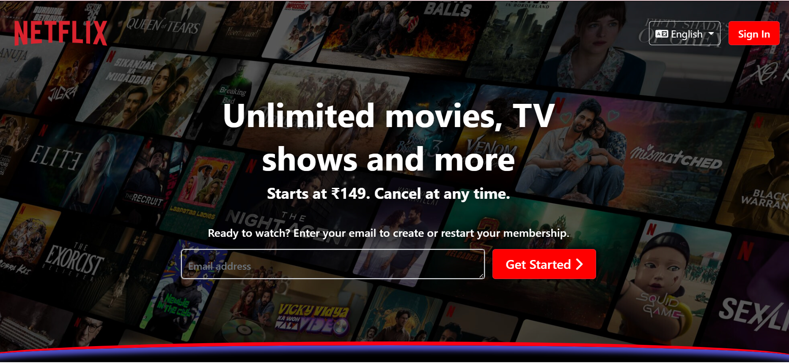
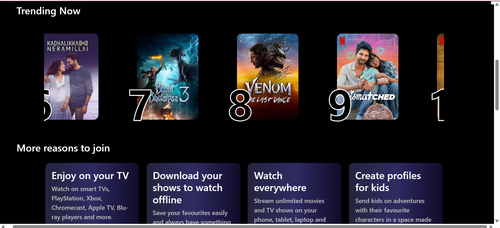

# 🎬 Netflix Clone  

A **fully responsive** **Netflix Clone** built using **HTML, CSS, and Bootstrap**, designed to replicate the sleek and immersive UI of Netflix.  

## 🚀 Features  

✅ **Hero Banner:** A stunning welcome screen with a CTA  
✅ **Movie/Show Sections:** Organized, scrollable content rows  
✅ **Hover Effects:** Smooth transitions for an interactive feel  
✅ **Fully Responsive:** Works seamlessly across all devices  
✅ **Navbar & Footer:** A clean, intuitive navigation system  

## 💡 Technologies Used  

- **HTML5** – Structuring the layout  
- **CSS3** – Custom styling with flexbox & grid  
- **Bootstrap 5** – For a responsive and mobile-friendly experience  

## 📸 Preview  

  
  

## 🛠️ How to Run  

1. **Clone the Repository:**  
   git clone https://github.com/ManvithaPola/Netflix-clone.git

2. **Navigate to the Project Folder:**  
   cd netflix-clone

3. **Open `index.html` in your browser.**  

## 🔗 Live Demo  
https://netflclone-manvitha.netlify.app/

